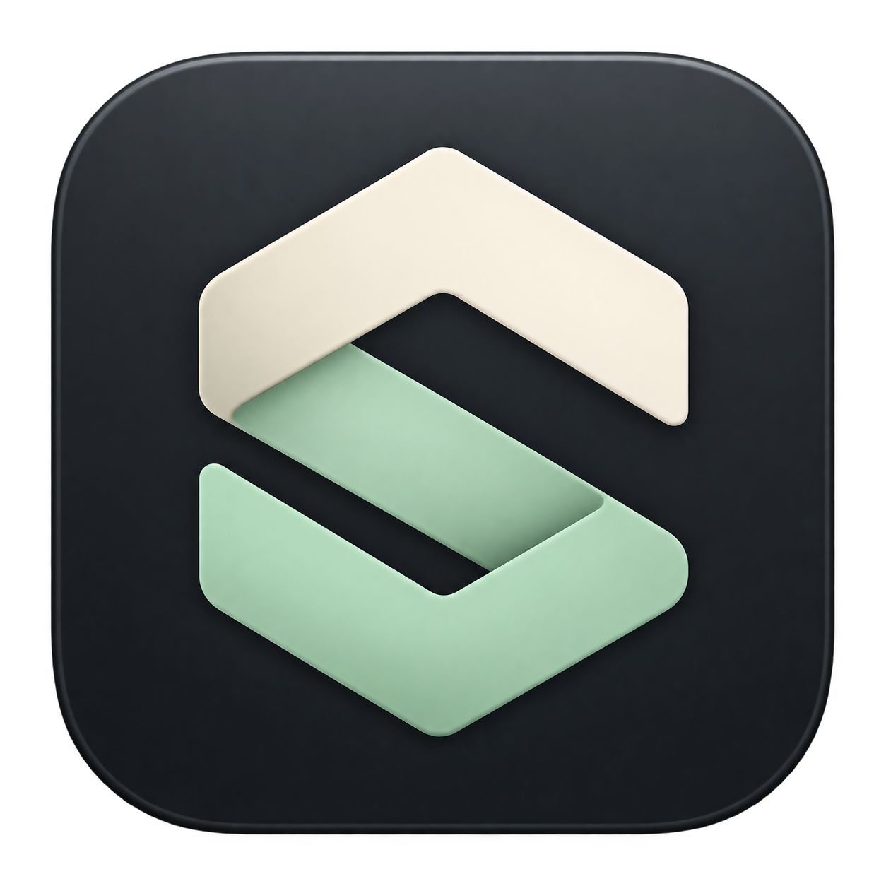

<p align="center"></p>

# Codex Switch

A small macOS menu bar app for choosing which signed-in ChatGPT account handles Codex requests and checking each account's remaining usage.

A native menu-bar interface using the system palette, default Liquid Glass surfaces and buttons, and standard progress indicators. The opaque main panel uses the system background; light/dark appearance and accessibility behavior follow macOS. Custom color palettes, painted borders, hover layers, and hand-drawn progress bars have been removed.

SwiftUI/AppKit, a local proxy, and no npm dependencies. The interface follows the Mac’s language preferences: Korean or English, with English as the fallback. Dates and times follow regional settings. Reopen the app after changing its language in macOS. [한국어 안내](README.ko.md)

macOS 14/15 use standard card surfaces. Building the native glass path requires Xcode 26 / Swift 6.2 or later. The current UI targets macOS 27 and retains a standard-material fallback on macOS 14/15. The app adds no screen capture or custom rendering loop.

## Install

Download the Apple Silicon app from [Releases](https://github.com/zzunkie/codex-switch/releases), unzip it, and move **Codex Switch.app** to Applications.

- macOS 14 or later.
- An installed Codex desktop app or Codex CLI, signed in with ChatGPT.
- The downloadable app is ad-hoc signed, **not Apple-notarized**. macOS may require **System Settings → Privacy & Security → Open Anyway** after the first launch attempt. Building from source is also supported.

## Use

1. Click the S icon in the menu bar. The existing Codex login appears automatically.
2. Click **계정 추가** (Add account) and complete the official browser login for another account. Device-code login is also available.
3. Click an account name or its selection circle, then enable **라우팅** (Routing).
4. Send a new Codex request. If the status stays at **Codex 연결 대기** (Waiting for Codex), restart Codex once to load the endpoint setting.

The current Codex login stays in place. Choosing an account affects new requests; an existing response finishes on its original account. There is no automatic fallback on authentication or quota errors.

The panel displays the quota windows returned by Codex. A weekly-only plan gets one bar; a plan with a five-hour and weekly window gets two. Separate model buckets live under **모델별 한도** (Model limits). Missing usage stays unknown, not 0%.

**응답 확인** (Response verified) means the proxy observed a model response completion for the chosen account during this app session. It is not a server health or quota guarantee.

## Reset credits

Each account shows its available reset-credit count. Unknown counts remain unavailable. Click **Use…** next to the intended account to review and confirm spending **one** credit. The confirmation defaults to Cancel.

New reset attempts require a core five-hour or weekly window with 10% or less remaining; separate model limits do not qualify. The account and usage are checked again after confirmation, and the server decides whether a reset is eligible. The original Codex login and routing selection are not changed by a reset.

If the result is uncertain, **Check result** retries the same approved request with the same durable idempotency key, including after an app restart. If the original request never arrived, this retry may perform it; a completed request cannot spend a second credit. Reset success stays confirmed even if the following usage refresh fails.

A recent Codex app-server is required. Counts use `account/rateLimits/read`; redemption uses `account/rateLimitResetCredit/consume`. `reset-attempts.json` in the app data directory preserves pending requests. Do not remove it while a request is unresolved. No reset credit is ever consumed by polling or automatically switching accounts.

Real account count reads have been checked. Redemption is tested with synthetic accounts and mock servers; tests do not spend real credits.

## Disconnect

Turn routing off to restore the previous endpoint setting. Use **설정 → 종료** (Settings → Quit) to restore it and stop the app. Restart Codex after quitting so it reloads the restored configuration.

If the app was force-killed, reopen it and turn routing off. The app keeps a recovery journal and config backups in its own data directory. It refuses to overwrite a managed routing block that was edited externally.

## How it works

```text
Codex → 127.0.0.1 proxy → Codex backend
             │
             └─ credentials of the manually selected account
```

The native menu bar popover talks to its bundled Node helper over standard input/output. The helper uses the installed `codex app-server` for login, token refresh, and quota reads. It changes the root `openai_base_url` in the existing Codex configuration while routing is enabled.

- The proxy binds only to loopback, uses a random route secret, rejects browser Origin headers, and forwards only explicitly supported paths to a fixed upstream.
- Additional account credentials stay in separate Codex homes under `~/Library/Application Support/Codex Switch/accounts/`, with restricted file permissions. The account list stores only names, email addresses, and plan labels.
- The original Codex credential store is reused. Its login is not copied into an added account or replaced.
- Prompts, response bodies, tokens, and cookies are not logged. Response completion metadata is kept in memory for the status display.
- The helper does not expose an HTTP control API. Unused account helper processes stop after 90 seconds; the selected account refreshes every two minutes while routing is enabled.
- `CODEX_HOME` is respected when present in the app's launch environment. Finder-launched apps normally use `~/.codex`.

## Compatibility and limits

This is an independent experimental utility, not an OpenAI product. It relies on Codex app-server and backend behavior that may change.

The built-in OpenAI provider is supported. Custom providers, profile-level endpoint overrides, and centrally managed configurations are not supported. Model requests over HTTP/SSE and WebSocket, model listing, image generation/edit paths, and the Codex web tool endpoint are supported. Unknown endpoints are rejected rather than forwarded automatically.

Codex may still show the original account's plan, usage, and entitlement UI. Routing does not change that UI or grant access to models unavailable to the selected account. Behavior when the original account is completely exhausted has not been verified. This app routes ChatGPT-authenticated Codex traffic; it is not a general API-key proxy.

## Build and test

Install Xcode Command Line Tools and run:

```sh
git clone https://github.com/zzunkie/codex-switch.git
cd codex-switch
zsh build.sh
open "dist/Codex Switch.app"
```

Set `CODEX_SWITCH_BUILD_DIR` to choose a separate staging directory when an existing build is running. Move the finished app into Applications and keep ZIPs for backups to avoid indexing duplicate app bundles.

The script builds for the host Mac's architecture (Apple Silicon or Intel), downloads a pinned official Node.js runtime, verifies its SHA-256 checksum, and applies a local ad-hoc signature. It does not copy a runtime from another installed app. The first build needs network access.

Run the tests with Node.js 24+, or use the packaged runtime after building:

```sh
node --test Tests/*.test.mjs
zsh Tools/test-localization.sh # macOS language selection and error formatting
# or
"dist/Codex Switch.app/Contents/Resources/Runtime/node" --test Tests/*.test.mjs
```

Tests use temporary directories, synthetic credentials, and local mock servers. They cover config restoration and conflicts, quota parsing, authentication refresh, request isolation, streaming, WebSocket account switching, and helper lifecycle. No real account or paid model request is required.

To inspect the UI with synthetic accounts:

```sh
open -n "dist/Codex Switch.app" --args --demo --show-popover --state-directory="$(mktemp -d)"
```

The demo does not sign in or modify the real Codex configuration. Production account routing and image generation/editing have been exercised locally with Codex CLI `0.154.0-alpha.6.2`; CI uses mocks and does not establish live-service compatibility.

## Contributing

See [CONTRIBUTING.md](CONTRIBUTING.md). For security issues, use [private vulnerability reporting](https://github.com/zzunkie/codex-switch/security/advisories/new). Do not attach account stores, config backups, or authentication tokens to public issues.

## License

[MIT](LICENSE). Bundled runtime licenses are listed in [THIRD_PARTY_NOTICES.md](THIRD_PARTY_NOTICES.md). Icon prompts are in [Assets/GENERATION.md](Assets/GENERATION.md).
